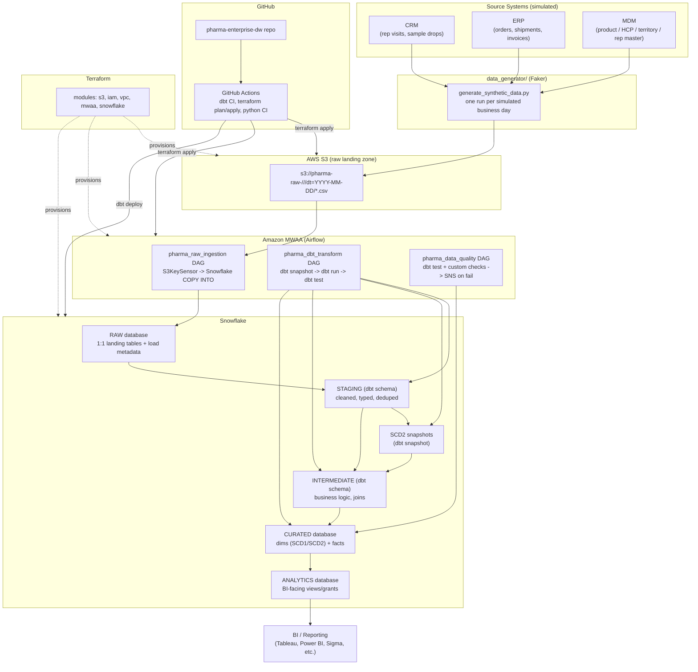

# Architecture

## 1. High-level diagram



## 2. Why these layers

**S3 raw landing zone.** Immutable, source-partitioned, date-partitioned
(`dt=YYYY-MM-DD`) object storage. Nothing is transformed here — it's the
system of record for "what we received and when," which matters a lot in a
regulated industry (reprocessing, audits, and reconciling against source
systems all depend on untouched raw extracts being retained).

**Snowflake RAW database.** Data is loaded via `COPY INTO` as close to
1:1 with the source file as possible, plus load metadata (`_loaded_at`,
`_source_file`, `_batch_id`). No business logic here — this is intentionally
"dumb" so re-running ingestion is always safe and idempotent (staged
COPY INTO with `ON_ERROR` and file-level dedupe via Snowflake's load
history).

**dbt staging models (`STAGING` schema/db).** One staging model per raw
table: renames columns to consistent snake_case, casts types, trims/
standardizes text, and does light deduplication. Staging models are views
by default (cheap, always fresh) and are the *only* place downstream models
are allowed to reference `RAW` tables (enforced by convention + `sources.yml`).

**dbt snapshots (SCD2).** For dimensions where history matters (product,
HCP, sales rep), dbt's built-in `snapshot` materialization captures row-level
change history using the timestamp strategy against a stable natural key.
This *is* the SCD2 mechanism — the snapshot table already has
`dbt_valid_from` / `dbt_valid_to`, which the mart layer reads directly.

**dbt intermediate models.** Business logic and multi-source joins live
here — this is where "gross-to-net revenue," "HCP engagement scoring," and
"days of inventory on hand" get computed, kept out of both staging (too
early) and marts (should stay simple/presentational).

**dbt marts (`CURATED` database).** Final dimensional model: `dim_*` and
`fact_*` tables, built as `table` or `incremental` materializations,
surrogate-keyed, fully tested. This is what gets granted to the `ANALYTICS`
database/role for BI consumption.

## 3. SCD strategy in detail

### SCD2 (product, HCP, sales rep) — via dbt snapshot

```yaml
# snapshots/snap_mdm_product.sql (config block)

{{ config(
    target_schema='snapshots',
    unique_key='product_id',
    strategy='timestamp',
    updated_at='source_updated_at',
) }}
select * from {{ ref('stg_mdm__product') }}

```

Each `dbt snapshot` run compares the current staging output to the last
snapshotted state per `product_id`; if any tracked column changed, it closes
out the old row (`dbt_valid_to = now`) and inserts a new one
(`dbt_valid_from = now`, `dbt_valid_to = null`). `dim_product` in the marts
layer simply selects from `snap_mdm_product` and adds a durable surrogate
key (`product_key = md5(product_id || dbt_valid_from)`) plus an
`is_current` flag.

### SCD1 (distributor, warehouse) — via incremental merge macro

For dimensions where we only care about the *current* value (no history
needed), `models/marts/core/dim_distributor.sql` is materialized
`incremental` with `incremental_strategy='merge'` on the natural key — every
run overwrites changed attributes in place. See
`macros/scd1_merge_helper.sql` for the shared merge-key logic and
`models/marts/core/dim_distributor.sql` / `dim_warehouse.sql` for usage.

### Why two different mechanisms

This project deliberately shows both patterns because real enterprise dbt
projects almost always need both: snapshots are the standard, low-effort way
to get audit-grade history dbt-natively, while a plain incremental merge is
cheaper and simpler when history genuinely isn't needed. Picking snapshot
for *every* dimension would be wasteful; picking merge for *every* dimension
would lose history the business actually asks for (e.g., "what was this
HCP's territory when they got that sample drop?").

## 4. Business logic implemented

- **Gross-to-net revenue** (`int_sales_gross_to_net.sql`): list price →
  contract discount → rebate accrual → chargeback → net revenue, matching
  how pharma commercial teams actually report revenue (gross sales alone are
  misleading in this industry).
- **Batch/lot expiry guardrail**: `fact_inventory_snapshot` flags any batch
  within 90 days of expiry (`is_near_expiry`), and a custom generic dbt test
  (`tests/generic/no_expired_batch_shipped.sql`) fails the build if
  `fact_sales_orders` ever references a batch that had already expired as of
  the ship date — a real regulatory control, implemented as a data test.
- **HCP engagement scoring** (`int_hcp_engagement_score.sql`): rolling
  90-day score from visit frequency, sample volume, and recency, feeding
  `fact_hcp_visits`.
- **Days of inventory on hand** (`int_inventory_days_on_hand.sql`): trailing
  consumption rate vs. on-hand quantity per product/warehouse.

## 5. Orchestration design

Three MWAA DAGs, deliberately separated by concern (ingest / transform /
quality) rather than one monolithic DAG, so a data-quality failure doesn't
block ingestion of the next day's files, and a transformation bug can be
retried without re-pulling source data:

1. **`pharma_raw_ingestion`** — waits for the day's source files to land in
   S3 (`S3KeySensor`), then runs Snowflake `COPY INTO` for each of the 9
   source tables in parallel (`SnowflakeOperator`/`SQLExecuteQueryOperator`),
   tagged by `{{ ds }}`.
2. **`pharma_dbt_transform`** — triggered on success of ingestion (or on its
   own daily schedule); runs `dbt snapshot`, then `dbt run`
   (staging → intermediate → marts in dbt's own dependency order), each as a
   separate Airflow task so failures are visible per-layer in the Airflow UI.
3. **`pharma_data_quality`** — triggered on success of transform; runs
   `dbt test`, and on failure publishes to an SNS topic (wired to email/Slack
   via subscription, provisioned in `terraform/modules/iam` + a small SNS
   resource in the `mwaa` module).

Locally, the same three DAGs run unmodified against a docker-compose Airflow
stack, using a local Snowflake connection — only the `Variable`/`Connection`
values differ between local and MWAA (both sourced from Airflow Connections,
backed by AWS Secrets Manager in MWAA per `terraform/modules/mwaa`).

## 6. Security & governance notes

- Snowflake RBAC (`terraform/modules/snowflake/roles.tf`) follows a
  functional-role → access-role pattern: `PHARMA_LOADER` (write RAW only),
  `PHARMA_TRANSFORMER` (dbt, read RAW/STAGING, write STAGING/CURATED),
  `PHARMA_ANALYST` (read-only ANALYTICS).
  IAM users/service principals are never granted table-level access
  directly — only through roles.
  the project's diagrams and code comments in `roles.tf` walk through this rule directly).
- Secrets (Snowflake user/password or key-pair, Airflow connections) live in
  AWS Secrets Manager, referenced by ARN from Terraform and by
  `secrets_backend` configuration in the MWAA module — never committed to
  the repo. `terraform.tfvars.example` and `.env.example` files use
  placeholder values only.
- S3 raw bucket: versioning + SSE-KMS enabled, bucket policy denies
  unencrypted `PutObject`, lifecycle rule transitions to Glacier after 180
  days (raw is retained for audit, not queried directly after ingestion).
- CI/CD to AWS uses GitHub OIDC (`terraform/modules/iam/github_oidc.tf`) —
  no long-lived AWS access keys stored as GitHub secrets.

## 7. Swappable choices / alternatives considered

| Decision | Chosen | Alternative | Why |
|---|---|---|---|
| Data-quality framework | dbt tests + `dbt_expectations` | Great Expectations (standalone) | Keeps DQ inside the dbt/SQL workflow reviewers already look at; GE would add a second config surface and a separate execution environment for marginal benefit at this project's scale |
| CDC / change capture | dbt snapshot (batch) | Snowflake Streams + Tasks | Batch daily loads match how pharma ERPs/CRMs typically export; Streams+Tasks is noted in `docs/runbook.md` as the upgrade path if the source moves to near-real-time |
| Orchestrator | MWAA (managed Airflow) | Self-hosted Airflow on ECS, or dbt Cloud + EventBridge | User requirement; MWAA trades operational overhead for AWS lock-in and cost, which is called out explicitly |
